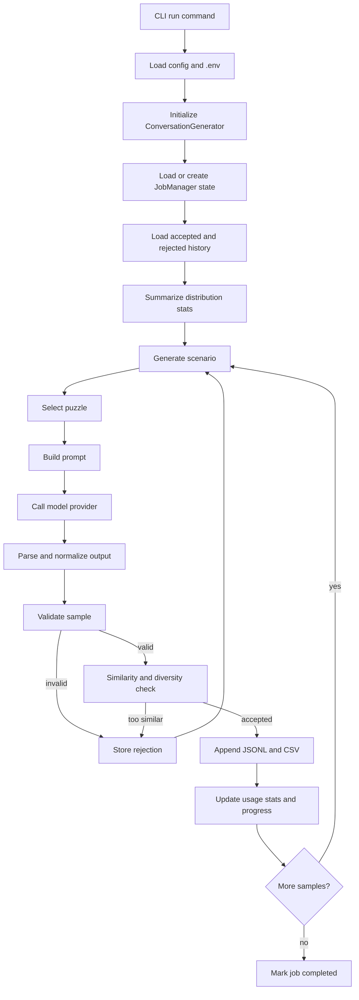

# Pipeline Internals

## Pipeline Overview
The current pipeline is a modular synthetic data generator for Sudoku conversations. It is organized around these stages:

```text
Scenario Generator
    -> Puzzle Manager
    -> LLM Chat Generator
    -> Validator
    -> Similarity & Diversity Checker
    -> Dataset Storage
```

The orchestration entry point is [src/generator/generator.py](C:/Users/emertxe-87/Desktop/Synthetic%20Sudoku%20Dataset/src/generator/generator.py).

## Processing Stages
### 1. Scenario Generator
Implementation:
- [src/generator/scenario.py](C:/Users/emertxe-87/Desktop/Synthetic%20Sudoku%20Dataset/src/generator/scenario.py)

Input:
- `sample_index`
- `conversation_type`
- `max_turns`
- current distribution statistics from previously accepted samples

Output:
- A `Scenario` dataclass with:
  - intent
  - conversation type
  - turn count
  - expertise
  - personality
  - assistant style
  - tone
  - difficulty
  - task category
  - edge case
  - tool usage
  - constraints

How it works:
- Reads candidate pools from `config.defaults.scenario`.
- Uses a deterministic `random_seed`.
- Prefers underrepresented values by selecting from the lowest-count bucket in each distribution.
- Derives `user_intent` from `task_category` and `edge_case`.
- Adds behavioral constraints, such as correcting incorrect assumptions politely or acknowledging malformed input.

### 2. Puzzle Manager
Implementation:
- [src/generator/puzzles.py](C:/Users/emertxe-87/Desktop/Synthetic%20Sudoku%20Dataset/src/generator/puzzles.py)

Input:
- A generated `Scenario`
- `sample_index`

Output:
- A `PuzzleRecord` dataclass

How it works:
- Loads a built-in puzzle bank in memory.
- Persists the bank to `puzzle_bank.jsonl` if it does not already exist.
- Tracks usage counts in `puzzle_usage.json`.
- Filters candidates by scenario difficulty when possible.
- Prefers puzzles with lower usage counts and lower parent usage.

Current puzzle sources:
- Built-in base puzzle bank only

Important limitation:
- The current code does not yet import curated external puzzle datasets, even though the architecture leaves room for it.

### 3. LLM Chat Generator
Implementation:
- [src/generator/generator.py](C:/Users/emertxe-87/Desktop/Synthetic%20Sudoku%20Dataset/src/generator/generator.py)
- [src/generator/model_client.py](C:/Users/emertxe-87/Desktop/Synthetic%20Sudoku%20Dataset/src/generator/model_client.py)

Input:
- Prompt template from `config/prompts.yaml`
- `Scenario`
- `PuzzleRecord`
- output schema instructions

Output:
- Raw model text, then normalized output dict

How it works:
- Builds a generation prompt containing:
  - system prompt
  - conversation-type prompt
  - serialized scenario JSON
  - serialized puzzle JSON
  - rendered puzzle board
  - output schema instructions
- Sends the prompt through `ModelClient`.
- Supports:
  - OpenAI Responses API
  - a custom chat-completions endpoint
  - a local mock fallback

Normalization behavior:
- Attempts to parse raw JSON
- Also extracts fenced JSON blocks such as ```` ```json ... ``` ````
- Falls back to treating the entire raw output as text if parsing fails
- Normalizes multi-turn outputs to `messages: [{user, response}, ...]`
- Normalizes single-turn outputs to `prompt` and `response`

### 4. Validator
Implementation:
- [src/generator/validation.py](C:/Users/emertxe-87/Desktop/Synthetic%20Sudoku%20Dataset/src/generator/validation.py)

Input:
- Normalized output
- `Scenario`
- `PuzzleRecord`

Output:
- `ValidationResult`

Current checks:
- `conversation_type` matches the scenario
- `category` matches the scenario task category
- required prompt/response fields are present
- multi-turn messages are non-empty
- output board matches the selected puzzle except for `malformed_input`
- standard scenarios do not use non-unique puzzle variants

Important limitation:
- The validator does not currently solve puzzles or mathematically verify Sudoku reasoning. It validates structure and consistency against the supplied puzzle object.

### 5. Similarity & Diversity Checker
Implementation:
- [src/generator/diversity.py](C:/Users/emertxe-87/Desktop/Synthetic%20Sudoku%20Dataset/src/generator/diversity.py)

Input:
- Candidate sample
- Accepted sample history

Output:
- `SimilarityResult`

Current similarity checks:
- exact duplicate text
- normalized text duplicate
- n-gram overlap
- token-vector cosine similarity
- structural similarity
- scenario similarity
- puzzle similarity

Current diversity tracking:
- task distribution
- difficulty distribution
- conversation length distribution
- user expertise distribution
- user personality distribution
- assistant style distribution
- tone distribution
- edge case distribution
- tool usage distribution
- puzzle reuse distribution

Important limitation:
- The “embedding similarity” metric is not a real embedding model today. It is a token-frequency cosine similarity proxy implemented locally.

### 6. Dataset Storage
Implementation:
- [src/generator/storage.py](C:/Users/emertxe-87/Desktop/Synthetic%20Sudoku%20Dataset/src/generator/storage.py)
- [src/generator/exporters.py](C:/Users/emertxe-87/Desktop/Synthetic%20Sudoku%20Dataset/src/generator/exporters.py)

Input:
- Accepted sample dicts
- Rejected sample dicts

Output:
- JSONL metadata files
- CSV exports
- aggregate stats

How it works:
- Appends accepted samples to `samples.jsonl`
- Appends rejected attempts to `rejected_samples.jsonl`
- Writes flattened accepted rows immediately to `single_turn.csv` or `multi_turn.csv`
- Updates `dataset_stats.json` incrementally

## Sample Generation
### Conversation types
The generator supports:
- `single_turn`
- `multi_turn`
- `both`

For `both`, each `sample_index` attempts one single-turn sample and one multi-turn sample.

### Scenario diversity logic
Scenario diversity is not left entirely to the LLM. It is driven by backend selection logic:
- underrepresented categories are favored
- expertise, tone, personality, and assistant style are varied
- edge cases are injected from config
- tool-usage labels are varied

### Puzzle variant creation
The puzzle manager creates variants from base puzzles using:
- identity
- digit relabeling
- row swaps within bands
- column swaps within stacks
- band swaps
- stack swaps
- rotation
- horizontal reflection

It also creates special edge-case variants:
- malformed input
- invalid board
- unsolvable board
- ambiguous board

Each variant keeps:
- `puzzle_id`
- `parent_puzzle_id`
- `canonical_signature`
- transformation metadata

### Regeneration logic
If a sample fails validation or similarity checks:
1. The rejection is written to `rejected_samples.jsonl`
2. The pipeline retries with a new scenario/puzzle attempt
3. Retries continue up to `generation.max_regeneration_attempts`
4. If all attempts fail, the job raises a `RuntimeError` and records the traceback in `progress.json`

### Randomization and determinism
The code uses deterministic seeds derived from:
- `generation.random_seed`
- `sample_index`
- conversation type

This means results are varied but still reproducible from the same code, config, and provider behavior.

## Execution Flow
### End-to-end lifecycle
1. CLI loads configuration from YAML and `.env`
2. `ConversationGenerator` initializes all pipeline components
3. `JobManager` creates or resumes a job directory
4. `DatasetStorage` loads accepted and rejected history
5. The diversity checker summarizes existing distribution stats
6. For each pending `sample_index`:
   - generate one or more scenarios
   - select puzzles
   - build prompts
   - call the model
   - parse and normalize the output
   - validate the sample
   - compare it against prior accepted history
   - store accepted or rejected results
   - update progress
7. On success, the job is marked `completed`
8. On interruption or failure, the job writes the latest state so it can resume later

### Mermaid flow diagram


## Extensibility
### Add a new stage
The orchestration is centralized in [src/generator/generator.py](C:/Users/emertxe-87/Desktop/Synthetic%20Sudoku%20Dataset/src/generator/generator.py). To add a new stage:
1. Create a dedicated module in `src/generator/`
2. Instantiate it in `ConversationGenerator.__init__`
3. Call it from `_generate_validated_sample` or another suitable orchestration point
4. Extend metadata and tests as needed

### Add new scenario dimensions
Update:
- `config/defaults.yaml`
- `src/generator/scenario.py`
- optionally `src/generator/models.py`

### Add new puzzle sources
The current `PuzzleManager` is the right extension point. You could add:
- external JSONL or CSV import
- curated dataset ingestion
- solver-backed uniqueness checks
- richer difficulty classification

### Add new sample types
Right now the pipeline only supports `single_turn` and `multi_turn`. To add another sample type, you would likely need to update:
- CLI argument validation
- scenario generation
- prompt building
- output normalization
- validation
- CSV flattening

### Add stronger validation or similarity models
Natural extension points:
- `SampleValidator` for rule-based or solver-based checks
- `SimilarityDiversityChecker` for real embedding services or ANN indexes

## Known Implementation Boundaries
These are based directly on the current code:
- No external puzzle corpus import exists yet.
- No true Sudoku solver or uniqueness verifier is implemented yet.
- The “embedding similarity” name currently refers to token-vector cosine similarity, not neural embeddings.
- There is no concurrency, batching, or distributed job execution in the current implementation.
- Configuration is YAML plus environment variables only; there is no separate experiment registry or database backend.
