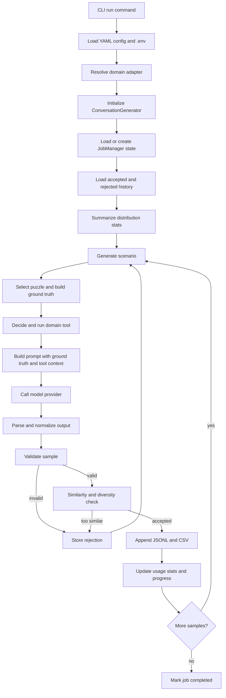

# Pipeline Internals

## Pipeline Overview
The generator is now structured as a shared pipeline plus a domain adapter. The shared pipeline handles job execution, retries, model calls, similarity checks, storage, and resume behavior. Domain-specific behavior lives behind `src/generator/domains`.

Registered domains:
- `sudoku`
- `kenken`
- `kakuro`
- `starbattle`
- `nonogram`
- `hitori`
- `nurikabe`
- `shikaku`
- `futoshiki`
- `kakurasu`
- `sumplete`
- `othello`
- `minesweeper`
- `wordle`
- `chess`

High-level flow:

```text
Domain Adapter
    -> Scenario Generator
    -> Puzzle Manager + Ground Truth
    -> Tool Usage Stage
    -> LLM Chat Generator
    -> Validator
    -> Similarity & Diversity Checker
    -> Dataset Storage
```

The orchestration entry point is `src/generator/generator.py`.

## Processing Stages
### 1. Domain Adapter
Implementation:
- `src/generator/domains/__init__.py`
- `src/generator/domains/sudoku.py`
- `src/generator/domains/kenken.py`
- `src/generator/domains/kakuro.py`
- `src/generator/domains/starbattle.py`
- `src/generator/domains/nonogram.py`
- `src/generator/domains/hitori.py`
- `src/generator/domains/nurikabe.py`
- `src/generator/domains/shikaku.py`
- `src/generator/domains/futoshiki.py`
- `src/generator/domains/kakurasu.py`
- `src/generator/domains/sumplete.py`
- `src/generator/domains/othello.py`
- `src/generator/domains/minesweeper.py`
- `src/generator/domains/wordle.py`
- `src/generator/domains/chess.py`

Input:
- domain name from config or `--domain`
- shared runtime config

Output:
- a domain adapter instance

How it works:
- `get_domain_adapter()` validates the requested domain.
- Unsupported domains raise a clear `ValueError`.
- Each adapter owns scenario generation, puzzle selection, prompts, tool decisions, validation, prompt context, and CSV row extensions.

### 2. Scenario Generator
Implementation:
- `src/generator/scenario.py`
- used through `src/generator/domains/sudoku.py`

Input:
- `sample_index`
- `conversation_type`
- `max_turns`
- current distribution statistics

Output:
- `Scenario`

How it works:
- Reads candidate pools from `config/defaults.yaml`.
- Uses deterministic seeded selection.
- Favors underrepresented distribution buckets.
- Produces task category, difficulty, edge case, persona, tone, assistant style, tool usage label, and constraints.

### 3. Puzzle Manager And Ground Truth
Implementation:
- `src/generator/puzzles.py`
- used through `src/generator/domains/sudoku.py`

Input:
- `Scenario`
- `sample_index`

Output:
- `PuzzleRecord`
- `PuzzleRecord.ground_truth`

How it works:
- Starts from the built-in Sudoku puzzle bank.
- Selects a puzzle matching scenario difficulty when possible.
- Prefers low-usage puzzles.
- Creates transformed or edge-case variants.
- Builds deterministic ground truth for every puzzle variant.

Ground truth currently includes:
- complete solution string
- rendered solved board
- validity status
- solvability status
- unique-solution status
- number of given and empty cells
- given cell positions
- empty cell positions
- candidate map
- conflicts
- suggested move when available

Current transformations:
- identity
- digit relabeling
- row swaps within bands
- column swaps within stacks
- band swaps
- stack swaps
- rotation
- horizontal reflection

Current edge-case variants:
- malformed input
- invalid board
- unsolvable board
- ambiguous board

### 4. Tool Usage Stage
Implementation:
- the selected domain adapter

Input:
- `Scenario`
- `PuzzleRecord`
- puzzle ground truth

Output:
- tool usage dictionary

How it works:
- Tool usage is decided by the selected adapter.
- Every supported domain currently requires at least two distinct, verified calls per accepted sample.
- The first call remains in the legacy primary-tool fields; the complete ordered bundle is recorded under `calls` with each tool's name, input, output, and reason.

Current Sudoku tools:
- `sudoku_candidate_scan`
- `sudoku_board_validation`
- `sudoku_solution_verification`
- `sudoku_rules_reference`
- `sudoku_board_summary`
- `sudoku_unit_analysis`
- `sudoku_naked_single_scan`
- `sudoku_hidden_single_scan`
- `sudoku_locked_candidate_scan`
- `sudoku_move_impact_analysis`

Current KenKen tools:
- `kenken_cage_analysis`
- `kenken_constraint_validation`
- `kenken_solution_verification`
- `kenken_rules_reference`
- `kenken_puzzle_summary`
- `kenken_latin_unit_analysis`
- `kenken_cage_feasibility`
- `kenken_cage_intersection_analysis`
- `kenken_move_impact_analysis`
- `kenken_solution_space_analysis`

Current Kakuro tools:
- `kakuro_run_analysis`
- `kakuro_constraint_validation`
- `kakuro_solution_verification`
- `kakuro_rules_reference`
- `kakuro_puzzle_summary`
- `kakuro_run_topology`
- `kakuro_crossing_analysis`
- `kakuro_run_feasibility`
- `kakuro_move_impact_analysis`
- `kakuro_solution_space_analysis`

Current Star Battle tools:
- `starbattle_candidate_analysis`
- `starbattle_constraint_validation`
- `starbattle_solution_verification`
- `starbattle_rules_reference`
- `starbattle_puzzle_summary`
- `starbattle_row_quota_analysis`
- `starbattle_column_quota_analysis`
- `starbattle_region_quota_analysis`
- `starbattle_adjacency_exclusion_scan`
- `starbattle_solution_space_analysis`

Current Nonogram tools:
- `nonogram_line_analysis`
- `nonogram_constraint_validation`
- `nonogram_solution_verification`
- `nonogram_rules_reference`
- `nonogram_puzzle_summary`
- `nonogram_row_pattern_analysis`
- `nonogram_column_pattern_analysis`
- `nonogram_overlap_deduction`
- `nonogram_cross_line_propagation`
- `nonogram_solution_space_analysis`

Current Hitori tools:
- `hitori_duplicate_analysis`
- `hitori_constraint_validation`
- `hitori_solution_verification`
- `hitori_rules_reference`
- `hitori_puzzle_summary`
- `hitori_row_duplicate_groups`
- `hitori_column_duplicate_groups`
- `hitori_adjacency_risk_analysis`
- `hitori_connectivity_analysis`
- `hitori_solution_space_analysis`

Current Nurikabe tools:
- `nurikabe_deduction_scan`
- `nurikabe_constraint_validation`
- `nurikabe_solution_verification`
- `nurikabe_rules_reference`
- `nurikabe_puzzle_summary`
- `nurikabe_island_capacity_analysis`
- `nurikabe_island_separation_scan`
- `nurikabe_sea_connectivity_analysis`
- `nurikabe_two_by_two_risk_scan`
- `nurikabe_solution_space_analysis`

Current Shikaku tools:
- `shikaku_rectangle_candidate_scan`
- `shikaku_constraint_validation`
- `shikaku_solution_verification`
- `shikaku_rules_reference`
- `shikaku_puzzle_summary`
- `shikaku_clue_area_analysis`
- `shikaku_exact_cover_analysis`
- `shikaku_cell_ownership_analysis`
- `shikaku_move_impact_analysis`
- `shikaku_solution_space_analysis`

Current Futoshiki tools:
- `futoshiki_candidate_scan`
- `futoshiki_constraint_validation`
- `futoshiki_solution_verification`
- `futoshiki_rules_reference`
- `futoshiki_puzzle_summary`
- `futoshiki_row_unit_analysis`
- `futoshiki_column_unit_analysis`
- `futoshiki_inequality_chain_analysis`
- `futoshiki_move_impact_analysis`
- `futoshiki_solution_space_analysis`

Current Kakurasu tools:
- `kakurasu_subset_analysis`
- `kakurasu_constraint_validation`
- `kakurasu_solution_verification`
- `kakurasu_rules_reference`
- `kakurasu_puzzle_summary`
- `kakurasu_row_pattern_analysis`
- `kakurasu_column_pattern_analysis`
- `kakurasu_weight_contribution_analysis`
- `kakurasu_move_impact_analysis`
- `kakurasu_solution_space_analysis`

Current Sumplete tools:
- `sumplete_subset_analysis`
- `sumplete_constraint_validation`
- `sumplete_solution_verification`
- `sumplete_rules_reference`
- `sumplete_puzzle_summary`
- `sumplete_row_subset_analysis`
- `sumplete_column_subset_analysis`
- `sumplete_target_balance_analysis`
- `sumplete_move_impact_analysis`
- `sumplete_solution_space_analysis`

Current Othello tools:
- `othello_board_validation`
- `othello_legal_move_scan`
- `othello_move_application`
- `othello_disc_count_analysis`
- `othello_mobility_analysis`
- `othello_positional_analysis`
- `othello_move_comparison`
- `othello_endgame_search`
- `othello_state_summary`
- `othello_rules_reference`

Current Minesweeper tools:
- `minesweeper_board_validation`
- `minesweeper_neighbor_analysis`
- `minesweeper_frontier_analysis`
- `minesweeper_forced_safe_scan`
- `minesweeper_forced_mine_scan`
- `minesweeper_probability_analysis`
- `minesweeper_flag_validation`
- `minesweeper_chord_analysis`
- `minesweeper_solution_space_analysis`
- `minesweeper_solution_verification`
- `minesweeper_board_summary`
- `minesweeper_rules_reference`

Current Wordle tools:
- `wordle_input_validation`
- `wordle_feedback_scoring`
- `wordle_history_validation`
- `wordle_candidate_filter`
- `wordle_letter_constraint_analysis`
- `wordle_frequency_analysis`
- `wordle_entropy_analysis`
- `wordle_guess_ranking`
- `wordle_hard_mode_validation`
- `wordle_duplicate_letter_analysis`
- `wordle_solution_verification`
- `wordle_game_summary`
- `wordle_rules_reference`

Current Chess tools:
- `chess_parse_validate`
- `chess_reconstruct_position`
- `chess_rules_reference`
- `chess_legal_example`
- `chess_input_diagnosis`
- `chess_legal_moves`
- `chess_legal_alternatives`
- `chess_move_validation`
- `chess_move_conversion`
- `chess_move_application`
- `chess_move_undo`
- `chess_position_summary`
- `chess_material_analysis`
- `chess_positional_features`
- `chess_repetition_history`
- `chess_tactical_inspection`
- `chess_position_status`
- `chess_engine_analysis`
- `chess_tablebase_lookup`
- `chess_state_trace`

Chess requires at least two successful, distinct calls and exact required/used-tool agreement. It keeps ordered calls under `tool_usage_details.calls` while retaining the existing primary `tool_name`, `tool_input`, `tool_output`, and `reason` fields; flat exports also include `tool_count`, `tool_names`, `tool_calls`, and `tool_bundle_signature`. Difficulty must equal the band computed from the position complexity score, while scheduling cycles through all four bands. Chess-specific code remains in `src/generator/chess.py` and `src/generator/domains/chess.py`. The `chess-v2` catalog supplies at least 256 deterministic game lineages, up to four snapshots per lineage, and dedicated special-position families. Canonical first-four-FEN-field and rendered-input signatures are reserved from accepted and rejected job history, preventing board or input reuse across retries and resumes. Game-history and FEN descendants share a lineage ID and dataset split; multi-turn verification includes an exact legal `fen_before`/`fen_after` trace for each played move. Edge scheduling is deterministic at three records per rolling 20-record window, with every edge derived from a unique valid base position and supplied with a category-compatible diagnostic bundle.

Stockfish verification is provisioned by `src/generator/chess_backends.py`: it uses configured/PATH binaries when present, otherwise selects the official stable platform asset, validates its release SHA-256, performs safe extraction and a UCI healthcheck, and caches it under the ignored output directory. Local Syzygy files take priority over the retrying online tablebase. With the default `verification_backends_required: true`, a missing or failed backend stops an objective engine/tablebase sample before the LLM request instead of emitting partially verified data. `python -m src.generator.chess_setup` performs an end-to-end backend healthcheck.

Tool output is included in:
- prompt context sent to the model
- accepted sample metadata
- rejected sample records
- CSV output columns
- dataset statistics

All domains expose an inspectable `tool_catalog` of immutable tool specifications. Startup validation enforces `puzzles.min_tool_catalog_size` (10 by default), domain-prefixed unique names, callable executors, registered routes, and reachability from configured scenarios. The eleven solver-backed logic-puzzle domains and Othello have 10 tools, Minesweeper has 12, Wordle has 13, and Chess has 20. Samples still use ordered, purposeful bundles—normally two to five distinct verified calls—rather than invoking the entire catalog. Shared code handles bundle schema, flattened export fields, complexity metadata, resume reservations, and enforcement; each domain adapter selects and executes its own rules, summary, candidate/deduction, constraint, solution-space, and verification tools. Difficulty scheduling cycles across easy, medium, hard, and expert whenever all four are configured.

Shikaku canonical state contains grid dimensions and row-major numbered clues. Its exact-cover solver enumerates every clue-compatible factor-pair rectangle, verifies complete non-overlapping coverage, and stores the canonical rectangle list, region ownership, candidate rectangles, violations, and capped solution count. Deterministic indexed lineages provide more than the eight geometric symmetries without puzzle reuse.

Futoshiki canonical state contains a grid size, sparse givens, and explicit ordered adjacent inequalities. Its solver combines Latin row/column uniqueness with inequality propagation, stores unit and inequality evaluations plus candidate evidence, and treats strict logical cycles as structurally valid but unsatisfiable puzzles. Standard Futoshiki has no box constraints.

Kakurasu canonical state contains dimensions plus row and column targets. Row totals use column weights `1..width`, column totals use row weights `1..height`, and its exact solver enumerates row subsets while pruning weighted column residuals. Ground truth stores masks, line evaluations, pattern evidence, forced states, and capped solution counts.

Sumplete canonical state contains dimensions, a numbered grid, and row and column targets for kept values. Its exact solver enumerates each row's value subsets and prunes column residuals using the remaining cell values. Ground truth stores the `#`-kept mask, kept/removed cells, line contributions, subset evidence, forced states, violations, and capped solution counts.

Othello canonical state is JSON containing an 8×8 row-major board, side to move, and pass count. Its local engine supplies directional flips, mobility/positional evidence, deterministic depth-limited alpha-beta recommendations, and exact searches for generated expert endgames with at most ten empty squares. Minesweeper canonical state contains only visible cells; component enumeration plus global mine-count convolution supplies exact counts and probabilities without enumerating every full layout, and the mine mask is projected only into explicit solve/verification prompts. Wordle canonical state contains guess/feedback history and hard-mode state; the target is similarly restricted to explicit verification. Its two-pass feedback, candidate, constraint, entropy, and ranking engine uses the checksum-verified offline 2,315-answer/12,972-guess assets under `src/generator/data`.

Solution-space tools run the domain solver with a two-solution cap. They report the capped count, solver status, and cells that differ between two ambiguity witnesses without exposing either witness grid. Malformed-input routes deliberately omit both solution-space and complete-solution verification tools.

### 5. LLM Chat Generator
Implementation:
- `src/generator/generator.py`
- `src/generator/model_client.py`

Input:
- prompt templates from `config/prompts.yaml`
- domain name
- scenario JSON
- puzzle JSON
- ground-truth JSON
- tool-context JSON
- rendered board
- output schema instructions

Output:
- normalized model output

How it works:
- Builds a prompt from scenario, puzzle, ground truth, and tool context.
- Sends it through `ModelClient`.
- Supports OpenAI, custom chat-completions, TensorStudio chat-completions, and mock fallback behavior.
- Parses raw JSON, fenced JSON, or embedded JSON.
- Normalizes single-turn output to `prompt` and `response`.
- Normalizes multi-turn output to `messages: [{user, response}, ...]`.

### 6. Validator
Implementation:
- `src/generator/validation.py`
- used through `src/generator/domains/sudoku.py`

Input:
- normalized output
- `Scenario`
- `PuzzleRecord`
- puzzle ground truth

Output:
- `ValidationResult`

Current checks:
- conversation type matches the scenario
- category matches the scenario task category
- required prompt/response fields are present
- multi-turn messages are non-empty
- output board matches the selected puzzle except for malformed input
- standard scenarios do not use non-unique puzzle variants
- ground-truth solution matches the puzzle solution
- standard scenarios have valid ground-truth status

Known limitation:
- Free-form prose is not a formal proof. Domain solvers and Chess verification backends establish the objective evidence supplied before generation; validators still check schema, state, metadata, and required verification status rather than attempting unrestricted natural-language theorem proving.

### 7. Similarity And Diversity Checker
Implementation:
- `src/generator/diversity.py`

Input:
- candidate sample
- accepted sample history

Output:
- `SimilarityResult`

Current checks:
- exact duplicate text
- normalized duplicate text
- n-gram overlap
- token-vector cosine similarity
- structural similarity
- scenario similarity
- puzzle similarity

Current diversity metrics:
- task distribution
- difficulty distribution
- conversation length distribution
- user expertise distribution
- user personality distribution
- assistant style distribution
- tone distribution
- edge case distribution
- tool usage distribution
- puzzle reuse distribution

Known limitation:
- The `embedding_similarity` metric is a local token-vector cosine proxy, not a neural embedding model.

### 8. Dataset Storage
Implementation:
- `src/generator/storage.py`
- `src/generator/exporters.py`

Input:
- accepted sample records
- rejected sample records

Output:
- `samples.jsonl`
- `rejected_samples.jsonl`
- `dataset_stats.json`
- `single_turn.csv`
- `multi_turn.csv`

How it works:
- Appends accepted records to JSONL.
- Appends rejected attempts to JSONL.
- Writes accepted rows incrementally to CSV.
- Includes domain, tool usage, ground truth, scenario, puzzle metadata, and output payloads in JSONL records.
- Lets the domain adapter extend flattened CSV rows.

## Sample Generation
### Conversation Types
Supported values:
- `single_turn`
- `multi_turn`
- `both`

For `both`, each `sample_index` attempts one single-turn sample and one multi-turn sample.

### Grounded Generation
The model is not treated as the source of Sudoku truth. The prompt includes deterministic puzzle ground truth and any required tool output before the model generates the conversation.

### Tool-Driven Variants
Sudoku tool usage is scenario-driven:
- candidate or next-move tasks use candidate scan output
- board validity tasks use validation/conflict output
- solution or mistake-correction tasks use solution verification output
- scenarios without a tool need record `used: false`

### Retry And Rejection
If validation or similarity checking fails:
1. The rejected attempt is written to `rejected_samples.jsonl`.
2. The pipeline tries another scenario/puzzle attempt.
3. Attempts continue up to `generation.max_regeneration_attempts`.
4. If every attempt fails, the job is marked failed in `progress.json`.

## Execution Flow

```mermaid
flowchart TD
    A[CLI run command] --> B[Load YAML config and .env]
    B --> C[Resolve domain adapter]
    C --> D[Initialize ConversationGenerator]
    D --> E[Load or create JobManager state]
    E --> F[Load accepted and rejected history]
    F --> G[Summarize distribution stats]
    G --> H[Generate scenario]
    H --> I[Select puzzle and build ground truth]
    I --> J[Decide and run domain tool]
    J --> K[Build prompt with ground truth and tool context]
    K --> L[Call model provider]
    L --> M[Parse and normalize output]
    M --> N[Validate sample]
    N -->|invalid| O[Store rejection]
    O --> H
    N -->|valid| P[Similarity and diversity check]
    P -->|too similar| O
    P -->|accepted| Q[Append JSONL and CSV]
    Q --> R[Update usage stats and progress]
    R --> S{More samples?}
    S -->|yes| H
    S -->|no| T[Mark job completed]
```

Lifecycle summary:
1. CLI loads config and env settings.
2. The requested domain is resolved.
3. Job state is created or resumed.
4. Existing accepted and rejected records are loaded.
5. Each pending sample index flows through scenario, puzzle, ground truth, tool, model, validation, similarity, and storage stages.
6. Progress is updated after each sample index.
7. Failures and interruptions preserve resume state.

## Request And Error Logs
Each job appends a readable `generation.log` and structured `generation_events.jsonl`. Model-call events record the sample and retry context, scenario and puzzle IDs, provider/model settings, prompt size and SHA-256, full request payload without credentials, raw successful response, or the exception and traceback. On failure, `progress.json.last_error_details` identifies the failed event and both log paths.

Before a model call, the generator enforces `generation.max_prompt_characters` (50,000 by default). An over-budget request is not sent; a `prompt_budget_exceeded` event records its exact size, scenario, puzzle, hash, and full credential-free prompt. KenKen projections keep the rendered cage layout as the sole full cage representation and reduce solver candidates to deterministic counts and short examples.

## Extensibility
### Add A New Domain
1. Create a new adapter under `src/generator/domains/`.
2. Implement scenario generation, problem selection, tool decision/execution, validation, prompt context, and CSV row formatting.
3. Register it in `SUPPORTED_DOMAINS` in `src/generator/domains/__init__.py`.
4. Add solver, adapter, configuration, prompt, and end-to-end tests for the new domain.
5. Document the new domain in `README.md`.

### Add New Sudoku Tools
Add the tool decision and execution logic in `SudokuDomainAdapter`.

The expected tool usage record shape is:

```json
{
  "used": true,
  "tool_name": "sudoku_candidate_scan",
  "tool_input": {},
  "tool_output": {},
  "reason": "The scenario asks for candidate or next-move guidance."
}
```

### Add Stronger Ground Truth
Sudoku ground truth lives in `src/generator/puzzles.py`; Chess and solver-backed KenKen, Kakuro, Star Battle, Nonogram, Hitori, Nurikabe, Shikaku, Futoshiki, Kakurasu, and Sumplete ground truth live in their respective domain engine modules.

### Add Stronger Validation
The validator lives in `src/generator/validation.py` and is invoked through the domain adapter. Solver-backed checks can be added there without changing storage or model code.

## Known Implementation Boundaries
- No external puzzle corpus import exists yet.
- No true Sudoku solver or uniqueness verifier is implemented yet.
- KenKen base puzzles and edge-case classifications are solver verified.
- Kakuro base puzzles and edge-case classifications are solver verified.
- Star Battle base puzzles and edge-case classifications are solver verified.
- Nonogram base puzzles and edge-case classifications are solver verified.
- Hitori base puzzles and edge-case classifications are solver verified.
- `embedding_similarity` currently means local token-vector cosine similarity.
- There is no concurrency, batching, or distributed job execution.
- Configuration is YAML plus environment variables only.
