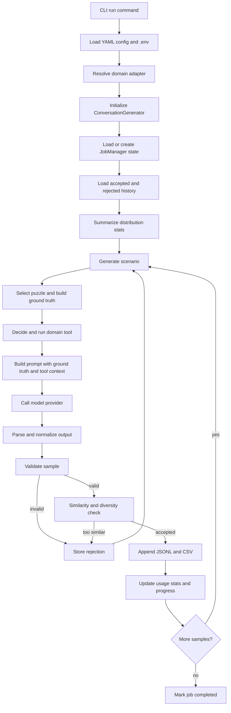

# Pipeline Internals

## Pipeline Overview
The generator is now structured as a shared pipeline plus a domain adapter. The shared pipeline handles job execution, retries, model calls, similarity checks, storage, and resume behavior. Domain-specific behavior lives behind `src/generator/domains`.

Registered domains:
- `sudoku`
- `kenken`
- `kakuro`

High-level flow:

```text
Domain Adapter
    -> Scenario Generator
    -> Puzzle Manager + Ground Truth
    -> Tool Usage Stage
    -> LLM Chat Generator
    -> Validator
    -> Similarity & Diversity Checker
    -> Dataset Storage
```

The orchestration entry point is `src/generator/generator.py`.

## Processing Stages
### 1. Domain Adapter
Implementation:
- `src/generator/domains/__init__.py`
- `src/generator/domains/sudoku.py`
- `src/generator/domains/kenken.py`
- `src/generator/domains/kakuro.py`

Input:
- domain name from config or `--domain`
- shared runtime config

Output:
- a domain adapter instance

How it works:
- `get_domain_adapter()` validates the requested domain.
- Unsupported domains raise a clear `ValueError`.
- Each adapter owns scenario generation, puzzle selection, prompts, tool decisions, validation, prompt context, and CSV row extensions.

### 2. Scenario Generator
Implementation:
- `src/generator/scenario.py`
- used through `src/generator/domains/sudoku.py`

Input:
- `sample_index`
- `conversation_type`
- `max_turns`
- current distribution statistics

Output:
- `Scenario`

How it works:
- Reads candidate pools from `config/defaults.yaml`.
- Uses deterministic seeded selection.
- Favors underrepresented distribution buckets.
- Produces task category, difficulty, edge case, persona, tone, assistant style, tool usage label, and constraints.

### 3. Puzzle Manager And Ground Truth
Implementation:
- `src/generator/puzzles.py`
- used through `src/generator/domains/sudoku.py`

Input:
- `Scenario`
- `sample_index`

Output:
- `PuzzleRecord`
- `PuzzleRecord.ground_truth`

How it works:
- Starts from the built-in Sudoku puzzle bank.
- Selects a puzzle matching scenario difficulty when possible.
- Prefers low-usage puzzles.
- Creates transformed or edge-case variants.
- Builds deterministic ground truth for every puzzle variant.

Ground truth currently includes:
- complete solution string
- rendered solved board
- validity status
- solvability status
- unique-solution status
- number of given and empty cells
- given cell positions
- empty cell positions
- candidate map
- conflicts
- suggested move when available

Current transformations:
- identity
- digit relabeling
- row swaps within bands
- column swaps within stacks
- band swaps
- stack swaps
- rotation
- horizontal reflection

Current edge-case variants:
- malformed input
- invalid board
- unsolvable board
- ambiguous board

### 4. Tool Usage Stage
Implementation:
- the selected domain adapter

Input:
- `Scenario`
- `PuzzleRecord`
- puzzle ground truth

Output:
- tool usage dictionary

How it works:
- Tool usage is decided by the selected adapter.
- If no tool is required, the sample records `used: false`.
- If a tool is required, the sample records tool name, input, output, and reason.

Current Sudoku tools:
- `sudoku_candidate_scan`
- `sudoku_board_validation`
- `sudoku_solution_verification`

Current KenKen tools:
- `kenken_cage_analysis`
- `kenken_constraint_validation`
- `kenken_solution_verification`

Current Kakuro tools:
- `kakuro_run_analysis`
- `kakuro_constraint_validation`
- `kakuro_solution_verification`

Tool output is included in:
- prompt context sent to the model
- accepted sample metadata
- rejected sample records
- CSV output columns
- dataset statistics

### 5. LLM Chat Generator
Implementation:
- `src/generator/generator.py`
- `src/generator/model_client.py`

Input:
- prompt templates from `config/prompts.yaml`
- domain name
- scenario JSON
- puzzle JSON
- ground-truth JSON
- tool-context JSON
- rendered board
- output schema instructions

Output:
- normalized model output

How it works:
- Builds a prompt from scenario, puzzle, ground truth, and tool context.
- Sends it through `ModelClient`.
- Supports OpenAI, custom chat-completions, TensorStudio chat-completions, and mock fallback behavior.
- Parses raw JSON, fenced JSON, or embedded JSON.
- Normalizes single-turn output to `prompt` and `response`.
- Normalizes multi-turn output to `messages: [{user, response}, ...]`.

### 6. Validator
Implementation:
- `src/generator/validation.py`
- used through `src/generator/domains/sudoku.py`

Input:
- normalized output
- `Scenario`
- `PuzzleRecord`
- puzzle ground truth

Output:
- `ValidationResult`

Current checks:
- conversation type matches the scenario
- category matches the scenario task category
- required prompt/response fields are present
- multi-turn messages are non-empty
- output board matches the selected puzzle except for malformed input
- standard scenarios do not use non-unique puzzle variants
- ground-truth solution matches the puzzle solution
- standard scenarios have valid ground-truth status

Known limitation:
- The validator does not yet perform full solver-backed reasoning verification.

### 7. Similarity And Diversity Checker
Implementation:
- `src/generator/diversity.py`

Input:
- candidate sample
- accepted sample history

Output:
- `SimilarityResult`

Current checks:
- exact duplicate text
- normalized duplicate text
- n-gram overlap
- token-vector cosine similarity
- structural similarity
- scenario similarity
- puzzle similarity

Current diversity metrics:
- task distribution
- difficulty distribution
- conversation length distribution
- user expertise distribution
- user personality distribution
- assistant style distribution
- tone distribution
- edge case distribution
- tool usage distribution
- puzzle reuse distribution

Known limitation:
- The `embedding_similarity` metric is a local token-vector cosine proxy, not a neural embedding model.

### 8. Dataset Storage
Implementation:
- `src/generator/storage.py`
- `src/generator/exporters.py`

Input:
- accepted sample records
- rejected sample records

Output:
- `samples.jsonl`
- `rejected_samples.jsonl`
- `dataset_stats.json`
- `single_turn.csv`
- `multi_turn.csv`

How it works:
- Appends accepted records to JSONL.
- Appends rejected attempts to JSONL.
- Writes accepted rows incrementally to CSV.
- Includes domain, tool usage, ground truth, scenario, puzzle metadata, and output payloads in JSONL records.
- Lets the domain adapter extend flattened CSV rows.

## Sample Generation
### Conversation Types
Supported values:
- `single_turn`
- `multi_turn`
- `both`

For `both`, each `sample_index` attempts one single-turn sample and one multi-turn sample.

### Grounded Generation
The model is not treated as the source of Sudoku truth. The prompt includes deterministic puzzle ground truth and any required tool output before the model generates the conversation.

### Tool-Driven Variants
Sudoku tool usage is scenario-driven:
- candidate or next-move tasks use candidate scan output
- board validity tasks use validation/conflict output
- solution or mistake-correction tasks use solution verification output
- scenarios without a tool need record `used: false`

### Retry And Rejection
If validation or similarity checking fails:
1. The rejected attempt is written to `rejected_samples.jsonl`.
2. The pipeline tries another scenario/puzzle attempt.
3. Attempts continue up to `generation.max_regeneration_attempts`.
4. If every attempt fails, the job is marked failed in `progress.json`.

## Execution Flow

```mermaid
flowchart TD
    A[CLI run command] --> B[Load YAML config and .env]
    B --> C[Resolve domain adapter]
    C --> D[Initialize ConversationGenerator]
    D --> E[Load or create JobManager state]
    E --> F[Load accepted and rejected history]
    F --> G[Summarize distribution stats]
    G --> H[Generate scenario]
    H --> I[Select puzzle and build ground truth]
    I --> J[Decide and run domain tool]
    J --> K[Build prompt with ground truth and tool context]
    K --> L[Call model provider]
    L --> M[Parse and normalize output]
    M --> N[Validate sample]
    N -->|invalid| O[Store rejection]
    O --> H
    N -->|valid| P[Similarity and diversity check]
    P -->|too similar| O
    P -->|accepted| Q[Append JSONL and CSV]
    Q --> R[Update usage stats and progress]
    R --> S{More samples?}
    S -->|yes| H
    S -->|no| T[Mark job completed]
```

Lifecycle summary:
1. CLI loads config and env settings.
2. The requested domain is resolved.
3. Job state is created or resumed.
4. Existing accepted and rejected records are loaded.
5. Each pending sample index flows through scenario, puzzle, ground truth, tool, model, validation, similarity, and storage stages.
6. Progress is updated after each sample index.
7. Failures and interruptions preserve resume state.

## Request And Error Logs
Each job appends a readable `generation.log` and structured `generation_events.jsonl`. Model-call events record the sample and retry context, scenario and puzzle IDs, provider/model settings, prompt size and SHA-256, full request payload without credentials, raw successful response, or the exception and traceback. On failure, `progress.json.last_error_details` identifies the failed event and both log paths.

Before a model call, the generator enforces `generation.max_prompt_characters` (50,000 by default). An over-budget request is not sent; a `prompt_budget_exceeded` event records its exact size, scenario, puzzle, hash, and full credential-free prompt. KenKen projections keep the rendered cage layout as the sole full cage representation and reduce solver candidates to deterministic counts and short examples.

## Extensibility
### Add A New Domain
1. Create a new adapter under `src/generator/domains/`.
2. Implement scenario generation, problem selection, tool decision/execution, validation, prompt context, and CSV row formatting.
3. Register it in `SUPPORTED_DOMAINS` in `src/generator/domains/__init__.py`.
4. Add tests for supported and unsupported domain behavior.
5. Document the new domain in `README.md`.

### Add New Sudoku Tools
Add the tool decision and execution logic in `SudokuDomainAdapter`.

The expected tool usage record shape is:

```json
{
  "used": true,
  "tool_name": "sudoku_candidate_scan",
  "tool_input": {},
  "tool_output": {},
  "reason": "The scenario asks for candidate or next-move guidance."
}
```

### Add Stronger Ground Truth
Sudoku ground truth lives in `src/generator/puzzles.py`; solver-backed KenKen and Kakuro ground truth live in their respective domain engine modules.

### Add Stronger Validation
The validator lives in `src/generator/validation.py` and is invoked through the domain adapter. Solver-backed checks can be added there without changing storage or model code.

## Known Implementation Boundaries
- No external puzzle corpus import exists yet.
- No true Sudoku solver or uniqueness verifier is implemented yet.
- KenKen base puzzles and edge-case classifications are solver verified.
- Kakuro base puzzles and edge-case classifications are solver verified.
- `embedding_similarity` currently means local token-vector cosine similarity.
- There is no concurrency, batching, or distributed job execution.
- Configuration is YAML plus environment variables only.
